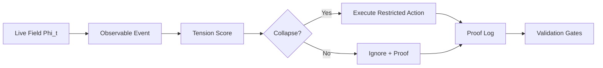

<p align="center">
  
</p>

<h1 align="center">PNVA-Core</h1>

<p align="center">
  <strong>A post-temporal causal architecture for state/event-oriented computation.</strong>
</p>

<p align="center">
  <a href="LICENSE"></a>
  <a href="LICENSE-DOCS"></a>
  
  
</p>

## What PNVA Is

PNVA-Core is a causal runtime architecture proposed by **Gustavo de Aguiar Martins / Enygnalab**.

It replaces execution by temporal habit with execution by observable cause:

```text
state -> event -> tension -> collapse -> execution -> proof
```

The central shift is simple:

```text
from: "is it time to check again?"
to:   "did the field change enough to justify action?"
```

PNVA is not presented here as a universal physical theory or a miracle optimization. It is a technical architecture for event-aware, proof-driven computation.

## Production Evidence

This repository publishes the sanitized evidence layer of a local live-field validation.

```text
15m live gate          PASS
8h live gate           PASS
12h live gate          PASS
24h live gate          PASS canonical
G1 stable opportunity  PASS
long-run-live-gate     PASS
guard rails            PASS
distribution-gate      PASS
production-candidate   PASS
```

The 24h result is intentionally documented as **canonical PASS**, not hidden as a pure raw PASS. The raw artifact captured a final `WARMUP`/selective-recompose transient after a stable long-run window. That distinction is preserved in the evidence.

## Architecture



Core layers:

```text
pnva-field        observes state
pnva-eventd       normalizes events
pnva-tension      estimates causal pressure
pnva-collapse     authorizes action
pnva-memory       preserves causal history
pnva-proof        emits auditable logs
pnva-fieldcomms   reflects state without owning policy
pnva-gates        validates production readiness
```

## Veonic Layer

PNVA introduces a computational concept called the **Veonic unit**:

```text
Veon = minimal logical unit of causal influence activated by threshold.
```

Formal sketch:

```text
S_t = { i | G_i(Phi_t) > theta_t }

nu_i,t = 1[G_i(Phi_t) > theta_t] * G_tilde_i(Phi_t)

D_i,t = alpha * grad(I_i) + beta * K_i(M_i) - gamma * A_i * u_i

V_i,t = nu_i,t * D_i,t

Phi_t+1 = Phi_t
        + eta_t * ( sum_{j in S_t} G_tilde_j(Phi_t)
        + delta * sum_{i in S_t} V_i,t )
        + mu_t * (Phi_t - Phi_t-1)
```

The Veon is a computational unit, not a claim of physical particle discovery.

## Repository Map

```text
docs/
  PNVA_ARCHITECTURE.md
  VALIDATION_PROTOCOL.md
  PROOF_MATRIX.md
  PNVA_SOVEREIGN_LOGS_ENTITIES_HEURISTICS.md
  PNVA_CANONICAL_EVENT_BRIDGE.md
  PNVA_ROBUSTNESS_EVOLUTION_REPORT_2026-05-05.md
  VEON_MODEL_VALIDATION.md
  PNVA_POST_TEMPORAL_CIVILIZATION.md
  PNVA_SOVEREIGNTY_PUBLICATION_SCALE.md
  PUBLIC_POSITIONING.md
  REPOSITORY_PUBLISHING_CHECKLIST.md
  LIMITATIONS.md
  ONLINE_PUBLICATION.md

paper/
  PNVA_CORE_OPEN_RESEARCH_PAPER.md

proofs/sanitized/
  JSON proof summaries suitable for public review

schemas/
  pnva-event.schema.json
  pnva-entity.schema.json

reports/
  pnva-sovereign-audit-2026-05-05.json
  pnva-canonical-events-sample-2026-05-05.jsonl
  pnva-entity-catalog-2026-05-05.json
  pnva-canonical-bridge-summary-2026-05-05.json

release/
  final production closure note
  professional public announcement draft

tools/
  sanitize_proofs.py
  pnva_sovereign_audit.py
  pnva_canonical_bridge.py
```

## Public Launch

For the first public announcement, use:

```text
release/POST_01_PROFISSIONAL_AUTORAL.md
```

For repository setup and publication order, use:

```text
docs/REPOSITORY_PUBLISHING_CHECKLIST.md
docs/PUBLIC_POSITIONING.md
```

## AI And Search Discovery

This repository includes a crawler-friendly public layer:

```text
index.html
author.html
pnva-core.html
proofs.html
veonic-model.html
robots.txt
sitemap.xml
llms.txt
```

GitHub Pages URL:

```text
https://enygnadev.github.io/pnva-core/
```

The `robots.txt` file allows OAI-SearchBot, GPTBot, ChatGPT-User, Googlebot, Bingbot and other crawlers so public AI/search systems can discover the canonical PNVA-Core pages.

## Public Claim

Use this claim:

```text
PNVA/no-tick was locally validated in a live field with 15m, 8h, 12h, 24h, G1, guard rails, distribution-gate and production-candidate PASS, using auditable JSON proof logs and documented canonical reclassification criteria.
```

Do not overclaim:

```text
Not a universal proof.
Not a full Linux kernel tick replacement claim.
Not a medical, legal or physical theory.
Not evidence that a Veon is a physical particle.
```

## Verify The Release Package

```bash
sha256sum -c SHA256SUMS.txt
python3 -m json.tool MANIFEST.json >/dev/null
for f in proofs/sanitized/*.json; do python3 -m json.tool "$f" >/dev/null; done
python3 tools/pnva_sovereign_audit.py --repo . --strict-public --min-score 80 >/tmp/pnva-sovereign-audit.json
python3 tools/pnva_canonical_bridge.py --demo --output /tmp/pnva-events.jsonl --entity-catalog /tmp/pnva-entities.json --summary /tmp/pnva-bridge.json
```

## Sovereign Robustness Layer

PNVA-Core now includes a canonical event/entity contract and an audit tool:

```text
schemas/pnva-event.schema.json
schemas/pnva-entity.schema.json
tools/pnva_sovereign_audit.py
```

The audit checks proof integrity, AI/search discovery, log contract readiness, publication hygiene and local log health when run inside the PNVA lab.

The canonical bridge converts legacy PNVA JSONL logs into `pnva.event.v1` envelopes, producing sanitized event samples and entity catalogs without exposing raw local logs.

## Citation

If this repository supports your research, cite:

```text
Gustavo de Aguiar Martins. PNVA-Core: A Post-Temporal Causal Architecture for State/Event-Oriented Computation. Open Research / Production Evidence Edition, 2026.
```

## Licenses

- Code and scripts: MIT.
- Documentation, paper and diagrams: CC BY 4.0.

## Author

**Gustavo de Aguiar Martins**  
Enygnalab / EnyOS / PNVA-Core  
GitHub: https://github.com/enygnadev
