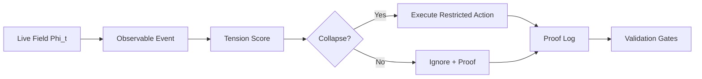

<p align="center">
  
</p>

<h1 align="center">PNVA-Core</h1>

<p align="center">
  <strong>A post-temporal causal architecture for state/event-oriented computation.</strong>
</p>

<p align="center">
  <a href="LICENSE"></a>
  <a href="LICENSE-DOCS"></a>
  
  
</p>

## What PNVA Is

PNVA-Core is a causal runtime architecture proposed by **Gustavo de Aguiar Martins / Enygnalab**.

It replaces execution by temporal habit with execution by observable cause:

```text
state -> event -> tension -> collapse -> execution -> proof
```

The central shift is simple:

```text
from: "is it time to check again?"
to:   "did the field change enough to justify action?"
```

PNVA is not presented here as a universal physical theory or a miracle optimization. It is a technical architecture for event-aware, proof-driven computation.

## Production Evidence

This repository publishes the sanitized evidence layer of a local live-field validation.

```text
15m live gate          PASS
8h live gate           PASS
12h live gate          PASS
24h live gate          PASS canonical
G1 stable opportunity  PASS
long-run-live-gate     PASS
guard rails            PASS
distribution-gate      PASS
production-candidate   PASS
```

The 24h result is intentionally documented as **canonical PASS**, not hidden as a pure raw PASS. The raw artifact captured a final `WARMUP`/selective-recompose transient after a stable long-run window. That distinction is preserved in the evidence.

## Architecture



Core layers:

```text
pnva-field        observes state
pnva-eventd       normalizes events
pnva-tension      estimates causal pressure
pnva-collapse     authorizes action
pnva-memory       preserves causal history
pnva-proof        emits auditable logs
pnva-fieldcomms   reflects state without owning policy
pnva-gates        validates production readiness
```

## Veonic Layer

PNVA introduces a computational concept called the **Veonic unit**:

```text
Veon = minimal logical unit of causal influence activated by threshold.
```

Formal sketch:

```text
S_t = { i | G_i(Phi_t) > theta_t }

nu_i,t = 1[G_i(Phi_t) > theta_t] * G_tilde_i(Phi_t)

D_i,t = alpha * grad(I_i) + beta * K_i(M_i) - gamma * A_i * u_i

V_i,t = nu_i,t * D_i,t

Phi_t+1 = Phi_t
        + eta_t * ( sum_{j in S_t} G_tilde_j(Phi_t)
        + delta * sum_{i in S_t} V_i,t )
        + mu_t * (Phi_t - Phi_t-1)
```

The Veon is a computational unit, not a claim of physical particle discovery.

## Repository Map

```text
docs/
  PNVA_ARCHITECTURE.md
  VALIDATION_PROTOCOL.md
  PROOF_MATRIX.md
  PNVA_SOVEREIGN_LOGS_ENTITIES_HEURISTICS.md
  PNVA_CANONICAL_EVENT_BRIDGE.md
  PNVA_REPLAY_VALIDATION.md
  PNVA_NO_TICK_INVARIANTS.md
  PNVA_NATIVE_EVENT_EMITTER.md
  PNVA_SOVEREIGN_POLICY_VALIDATION.md
  PNVA_PROOF_CHAIN_SEALING.md
  PNVA_CAUSAL_GRAPH_AUDIT.md
  PNVA_SCHEMA_CONTRACT_VALIDATION.md
  PNVA_CAUSAL_CHRONOLOGY_GUARD.md
  PNVA_TENSION_DECISION_CALIBRATION.md
  PNVA_DECISION_TRACE_INDEX.md
  PNVA_HEURISTIC_INFLUENCE_MAP.md
  PNVA_ENTITY_NO_TICK_MATRIX.md
  PNVA_SUPPRESSION_LEDGER.md
  PNVA_SOVEREIGN_EVIDENCE_ATTESTATION.md
  PNVA_ADVERSARIAL_VALIDATION.md
  PNVA_ENTITY_HEURISTIC_MATURITY.md
  PNVA_SEMANTIC_CONSISTENCY_GUARD.md
  PNVA_REPRODUCIBILITY_GUARD.md
  PNVA_ROBUSTNESS_EVOLUTION_REPORT_2026-05-05.md
  VEON_MODEL_VALIDATION.md
  PNVA_POST_TEMPORAL_CIVILIZATION.md
  PNVA_SOVEREIGNTY_PUBLICATION_SCALE.md
  PUBLIC_POSITIONING.md
  REPOSITORY_PUBLISHING_CHECKLIST.md
  LIMITATIONS.md
  ONLINE_PUBLICATION.md

paper/
  PNVA_CORE_OPEN_RESEARCH_PAPER.md

proofs/sanitized/
  JSON proof summaries suitable for public review

schemas/
  pnva-event.schema.json
  pnva-entity.schema.json

reports/
  pnva-sovereign-audit-2026-05-05.json
  pnva-canonical-events-sample-2026-05-05.jsonl
  pnva-entity-catalog-2026-05-05.json
  pnva-canonical-bridge-summary-2026-05-05.json
  pnva-replay-validation-2026-05-05.json
  pnva-no-tick-invariants-2026-05-05.json
  pnva-native-events-demo-2026-05-05.jsonl
  pnva-native-entity-catalog-demo-2026-05-05.json
  pnva-native-emitter-summary-2026-05-05.json
  pnva-native-replay-validation-2026-05-05.json
  pnva-native-no-tick-invariants-2026-05-05.json
  pnva-sovereign-policy-2026-05-05.json
  pnva-native-sovereign-policy-2026-05-05.json
  pnva-proof-chain-2026-05-05.json
  pnva-native-proof-chain-2026-05-05.json
  pnva-causal-graph-2026-05-05.json
  pnva-native-causal-graph-2026-05-05.json
  pnva-schema-contract-validation-2026-05-05.json
  pnva-causal-chronology-2026-05-05.json
  pnva-tension-decision-calibration-2026-05-05.json
  pnva-decision-trace-index-2026-05-05.json
  pnva-heuristic-influence-map-2026-05-05.json
  pnva-entity-no-tick-matrix-2026-05-05.json
  pnva-suppression-ledger-2026-05-05.json
  pnva-sovereign-evidence-attestation-2026-05-05.json
  pnva-adversarial-validation-2026-05-05.json
  pnva-entity-heuristic-maturity-2026-05-05.json
  pnva-semantic-consistency-2026-05-05.json
  pnva-reproducibility-2026-05-05.json

release/
  final production closure note
  professional public announcement draft

tools/
  sanitize_proofs.py
  pnva_sovereign_audit.py
  pnva_canonical_bridge.py
  pnva_replay_validator.py
  pnva_no_tick_invariant_analyzer.py
  pnva_native_event_emitter.py
  pnva_sovereign_policy_validator.py
  pnva_proof_chain_sealer.py
  pnva_causal_graph_auditor.py
  pnva_schema_contract_validator.py
  pnva_causal_chronology_guard.py
  pnva_tension_decision_calibrator.py
  pnva_decision_trace_index.py
  pnva_heuristic_influence_map.py
  pnva_entity_no_tick_matrix.py
  pnva_suppression_ledger.py
  pnva_evidence_attestor.py
  pnva_adversarial_validator.py
  pnva_entity_heuristic_maturity.py
  pnva_semantic_consistency_guard.py
  pnva_reproducibility_guard.py
```

## Public Launch

For the first public announcement, use:

```text
release/POST_01_PROFISSIONAL_AUTORAL.md
```

For repository setup and publication order, use:

```text
docs/REPOSITORY_PUBLISHING_CHECKLIST.md
docs/PUBLIC_POSITIONING.md
```

## AI And Search Discovery

This repository includes a crawler-friendly public layer:

```text
index.html
author.html
pnva-core.html
proofs.html
veonic-model.html
robots.txt
sitemap.xml
llms.txt
```

GitHub Pages URL:

```text
https://enygnadev.github.io/pnva-core/
```

The `robots.txt` file allows OAI-SearchBot, GPTBot, ChatGPT-User, Googlebot, Bingbot and other crawlers so public AI/search systems can discover the canonical PNVA-Core pages.

## Public Claim

Use this claim:

```text
PNVA/no-tick was locally validated in a live field with 15m, 8h, 12h, 24h, G1, guard rails, distribution-gate and production-candidate PASS, using auditable JSON proof logs and documented canonical reclassification criteria.
```

Do not overclaim:

```text
Not a universal proof.
Not a full Linux kernel tick replacement claim.
Not a medical, legal or physical theory.
Not evidence that a Veon is a physical particle.
```

## Verify The Release Package

```bash
sha256sum -c SHA256SUMS.txt
python3 -m json.tool MANIFEST.json >/dev/null
for f in proofs/sanitized/*.json; do python3 -m json.tool "$f" >/dev/null; done
python3 tools/pnva_sovereign_audit.py --repo . --strict-public --min-score 80 >/tmp/pnva-sovereign-audit.json
python3 tools/pnva_canonical_bridge.py --demo --output /tmp/pnva-events.jsonl --entity-catalog /tmp/pnva-entities.json --summary /tmp/pnva-bridge.json
python3 tools/pnva_replay_validator.py --events reports/pnva-canonical-events-sample-2026-05-05.jsonl --entity-catalog reports/pnva-entity-catalog-2026-05-05.json >/tmp/pnva-replay.json
python3 tools/pnva_no_tick_invariant_analyzer.py --events reports/pnva-canonical-events-sample-2026-05-05.jsonl --entity-catalog reports/pnva-entity-catalog-2026-05-05.json --replay-report reports/pnva-replay-validation-2026-05-05.json >/tmp/pnva-no-tick-invariants.json
python3 tools/pnva_native_event_emitter.py --events /tmp/pnva-native-events.jsonl --entity-catalog /tmp/pnva-native-entities.json --summary /tmp/pnva-native-summary.json
python3 tools/pnva_sovereign_policy_validator.py --events reports/pnva-canonical-events-sample-2026-05-05.jsonl --entity-catalog reports/pnva-entity-catalog-2026-05-05.json >/tmp/pnva-sovereign-policy.json
python3 tools/pnva_proof_chain_sealer.py --events reports/pnva-canonical-events-sample-2026-05-05.jsonl >/tmp/pnva-proof-chain.json
python3 tools/pnva_causal_graph_auditor.py --events reports/pnva-canonical-events-sample-2026-05-05.jsonl --entity-catalog reports/pnva-entity-catalog-2026-05-05.json >/tmp/pnva-causal-graph.json
python3 tools/pnva_adversarial_validator.py --write /tmp/pnva-adversarial-validation.json
python3 tools/pnva_entity_heuristic_maturity.py --write /tmp/pnva-entity-heuristic-maturity.json
python3 tools/pnva_schema_contract_validator.py --write /tmp/pnva-schema-contract-validation.json
python3 tools/pnva_causal_chronology_guard.py --write /tmp/pnva-causal-chronology.json
python3 tools/pnva_tension_decision_calibrator.py --write /tmp/pnva-tension-decision-calibration.json
python3 tools/pnva_decision_trace_index.py --write /tmp/pnva-decision-trace-index.json
python3 tools/pnva_heuristic_influence_map.py --write /tmp/pnva-heuristic-influence-map.json
python3 tools/pnva_entity_no_tick_matrix.py --write /tmp/pnva-entity-no-tick-matrix.json
python3 tools/pnva_suppression_ledger.py --write /tmp/pnva-suppression-ledger.json
python3 tools/pnva_evidence_attestor.py --write /tmp/pnva-evidence-attestation.json
python3 tools/pnva_semantic_consistency_guard.py --write /tmp/pnva-semantic-consistency.json
python3 tools/pnva_reproducibility_guard.py --write /tmp/pnva-reproducibility.json
```

## Sovereign Robustness Layer

PNVA-Core now includes a canonical event/entity contract and an audit tool:

```text
schemas/pnva-event.schema.json
schemas/pnva-entity.schema.json
tools/pnva_sovereign_audit.py
```

The audit checks proof integrity, AI/search discovery, log contract readiness, publication hygiene and local log health when run inside the PNVA lab.

The canonical bridge converts legacy PNVA JSONL logs into `pnva.event.v1` envelopes, producing sanitized event samples and entity catalogs without exposing raw local logs.

The replay validator checks that the canonical event sequence is internally consistent, proof-hash stable and guard-aware.

The no-tick invariant analyzer proves the stronger PNVA claim: execution and non-execution are both causal, entity-aware, heuristic-visible and proof-backed. The current public report classifies the sample as `SOVEREIGN_NO_TICK_READY` with `246` causal suppressions over `512` events.

The native event emitter shows the production direction: new PNVA runtimes can emit `pnva.event.v1` directly, before any legacy bridge is needed. The current native demo is `NATIVE_EMITTER_READY`, replay-valid and no-tick-invariant-valid.

The sovereign policy validator checks heuristic authority. The canonical sample is `SOVEREIGN_POLICY_READY_WITH_LEGACY_WARNINGS`, preserving 35 low-authority legacy strong decisions as explicit warnings. The native sample is `SOVEREIGN_POLICY_READY` with zero warnings.

The proof-chain sealer adds sequence-level tamper evidence. It seals canonical and native event order with final chain hashes, so content or ordering changes alter the public chain anchor.

The causal graph auditor exposes entity topology: observed entities, guard relations, causal-chain edges and graph hashes. Both canonical and native graphs are `CAUSAL_GRAPH_READY`.

The schema contract validator checks public `pnva.event.v1` logs and `pnva.entity.v1` catalogs for required fields, finite tension values, decision shape, heuristic context, proof hashes, relation targets and sanitization. The current package is `SCHEMA_CONTRACT_READY_WITH_LEGACY_WARNINGS` with `519` events, `12` entities, `0` errors and `341` explicit legacy warnings; the native scope has `0` warnings.

The causal chronology guard checks timestamp order and time-gap evidence. The current package is `CAUSAL_CHRONOLOGY_READY_WITH_LEGACY_WARNINGS` with `519` events, `15` chains, `0` errors and `2` explicit legacy chronology warnings; the native scope is monotonic and clean.

The tension-decision calibrator checks whether `score`, `threshold`, `gate_delta`, guard events and `decision.kind` agree. The current package is `TENSION_DECISION_READY_WITH_LEGACY_WARNINGS` with `519` events, `0` errors and `384` explicit legacy warnings; the native scope is calibrated and clean.

The decision trace index maps every public event to entity, heuristic rules, authority, tension and proof. The current package is `DECISION_TRACE_INDEX_READY_WITH_LEGACY_WARNINGS` with `519` traced events, trace coverage `1.0`, proof coverage `1.0`, `0` errors and `152` preserved legacy low-authority trace warnings; the native trace path is clean.

The heuristic influence map quantifies rule influence by decision, authority, entity reach and proof coverage. The current package is `HEURISTIC_INFLUENCE_MAP_READY_WITH_LEGACY_WARNINGS` with `1136` influence edges, heuristic coverage `1.0`, proof-event coverage `1.0`, `0` errors and `70` preserved legacy warnings; native influence is clean.

The entity no-tick matrix attributes execution and suppression by entity, heuristic rule, authority and proof. The current package is `ENTITY_NO_TICK_MATRIX_READY_WITH_LEGACY_WARNINGS` with `519` events, `12` entity rows, `250` suppressions, `0` errors and `35` preserved legacy warnings; the native matrix is clean.

The suppression ledger treats non-execution as proof-backed work avoidance. The current package is `SUPPRESSION_LEDGER_READY_WITH_LEGACY_WARNINGS` with `250` suppressions, `250` estimated avoided executions, proof coverage `1.0`, `0` errors and `176` preserved legacy threshold warnings; native suppression is clean.

The adversarial validator runs negative controls against the public validators. The current package is `ADVERSARIAL_VALIDATION_PASS` with `7` detections over `7` controlled mutations.

The entity and heuristic maturity auditor scores actor/rule readiness across entity coverage, proof coverage, no-tick suppression, authority and causal relations. The current package is `ENTITY_HEURISTIC_MATURITY_READY_WITH_LEGACY_WARNINGS` with score `94.59`, `0` errors and `35` preserved legacy warnings.

The semantic consistency guard checks cross-report agreement across Manifest, replay, no-tick, policy, proof-chain, graph, schema contract, causal chronology, tension-decision calibration, decision trace index, heuristic influence map, entity no-tick matrix, suppression ledger, maturity, adversarial validation, attestation and audit. The current package is `SEMANTIC_CONSISTENCY_READY` with the public report's check count, `0` errors and `0` warnings.

The reproducibility guard reruns the current evidence commands and compares stable fields against the published reports. The current package is `REPRODUCIBILITY_READY` with the public report's command/comparison counts and `0` failures.

The sovereign evidence attestor binds the public evidence base into one machine-readable attestation. The current package is `PNVA_SOVEREIGN_EVIDENCE_ATTESTED` with the public report's tracked artifact count and `0` failures; the sovereign audit consumes this attestation without being included in its hash seed.

## Citation

If this repository supports your research, cite:

```text
Gustavo de Aguiar Martins. PNVA-Core: A Post-Temporal Causal Architecture for State/Event-Oriented Computation. Open Research / Production Evidence Edition, 2026.
```

## Licenses

- Code and scripts: MIT.
- Documentation, paper and diagrams: CC BY 4.0.

## Author

**Gustavo de Aguiar Martins**  
Enygnalab / EnyOS / PNVA-Core  
GitHub: https://github.com/enygnadev
