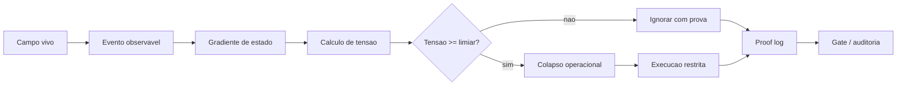

# PNVA Architecture

## Definicao

PNVA-Core e uma arquitetura causal para computacao orientada a estado, evento, tensao e colapso operacional. A arquitetura trata o computador como um campo de estados observaveis e substitui execucoes periodicas desnecessarias por decisoes justificadas por mudanca real.

```text
Campo(t) -> Evento(t) -> Tensao(t) -> Colapso(t) -> Execucao(t) -> Prova(t)
```

## Problema

Modelos baseados em tick, polling e timers fixos fazem uma pergunta limitada:

```text
ja chegou a hora de verificar de novo?
```

PNVA troca a pergunta:

```text
o estado mudou o suficiente para justificar execucao?
```

Essa mudanca permite menos verificacoes vazias, menor ruido operacional e logs mais explicaveis.

## Principios

1. Nao executar sem causa observavel.
2. Nao afirmar sem prova.
3. Nao otimizar sem benchmark.
4. Nao transformar aprendizado em caixa-preta.
5. Nao confundir simbolo com evidencia.
6. Nao enfraquecer guard rails para obter PASS artificial.

## Modelo formal

### Campo

Campo e o conjunto de estados observaveis do sistema:

```text
Phi(t) = {processos, janelas, input, rede, disco, GPU, memoria, latencia, eventos, logs}
```

### Evento

Evento e uma mudanca detectavel no campo:

```text
E(t) = delta(Phi(t))
```

### Tensao

Tensao e uma prioridade operacional mensuravel:

```text
T = alpha E + beta G - gamma C + mu M
```

Onde:

| Simbolo | Significado |
| --- | --- |
| `E` | peso do evento |
| `G` | gradiente de mudanca do estado |
| `C` | custo computacional estimado |
| `M` | memoria causal |
| `alpha,beta,gamma,mu` | pesos de decisao |

### Colapso

Colapso e a autorizacao de execucao:

```text
collapse = T >= theta
```

Se a tensao nao supera o limite, o sistema observa e registra. Se supera, executa e prova.

## Runtime

O runtime PNVA e dividido em camadas:

```text
pnva-field        observa campo
pnva-eventd       recebe e normaliza eventos
pnva-tension      calcula prioridade causal
pnva-collapse     decide execucao
pnva-memory       preserva historico e aprendizado explicavel
pnva-proof        grava evidencia auditavel
pnva-fieldcomms   reflete estado sem alterar core
pnva-gates        valida producao
```

## Fluxo operacional



## No-tick

No-tick, no contexto PNVA, nao significa ausencia absoluta de tempo. Significa que o tempo deixa de ser o motor cego da execucao. O tempo continua existindo como:

- limite;
- ordenacao;
- janela de observacao;
- timeout;
- criterio de estabilidade.

Mas a causa primaria passa a ser estado/evento.

## Estado de producao

O fechamento local atual validou:

```text
15m live gate          PASS
8h live gate           PASS
12h live gate          PASS
24h live gate          PASS canonico
G1 stable opportunity  PASS
long-run-live-gate     PASS
guard rails            PASS
distribution-gate      PASS
production-candidate   PASS
```

## Interpretacao do 24h

O `24h` e PASS canonico, nao PASS bruto puro. O bruto falhou porque o ultimo snapshot pegou `WARMUP`/`PNVA_SELECTIVE_RECOMPOSE` no fechamento. A janela mostrou:

```text
sample_count             = 721
steady_sample_count      = 718
steady_quiet_ratio       = 0.996
steady_quiet_wakeups_max = 0.83
allowlist_growth         = 1
allowlist_max            = 2
recovery_growth          = 0
retention                = OK
fieldcomms               = OK
```

Classificacao:

```text
PASS_EVENT_AWARE_24H_FINAL_TRANSIENT_STABLE_WINDOW
```

## Arquitetura de prova

PNVA nao depende de uma afirmacao unica. Ele fecha por cadeia:

```text
provas unitarias -> gates vivos -> guard rails -> distribution gate -> production candidate
```

Cada prova tem:

- entrada;
- criterio;
- metrica;
- artefato JSON;
- classificacao;
- limite honesto.

## O que torna a arquitetura robusta

- Separacao entre core, fieldcomms e gates.
- Modo observador antes de modo executor.
- Guard rails para caminhos sensiveis.
- Reclassificacao canonica documentada, nunca apagando o bruto.
- G1 separado entre captura real e ausencia legitima de oportunidade.
- Release com provas sanitizadas para publicacao.

